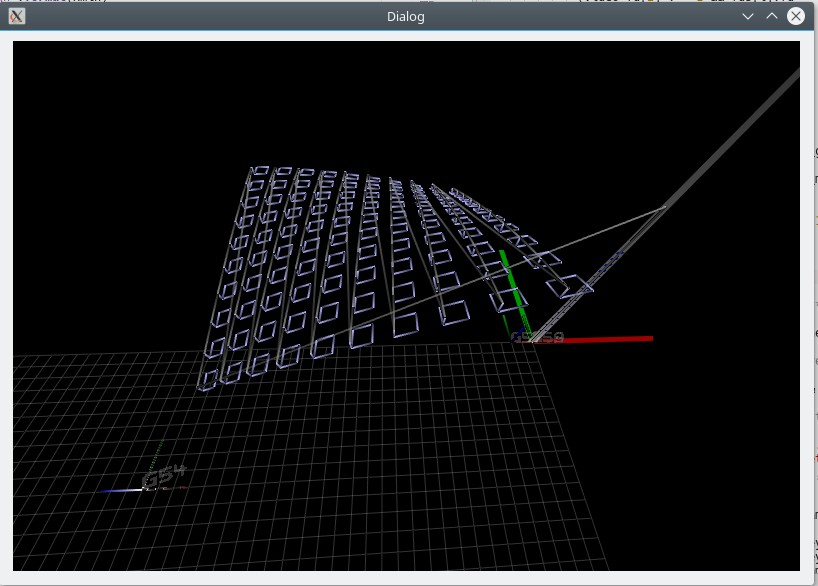
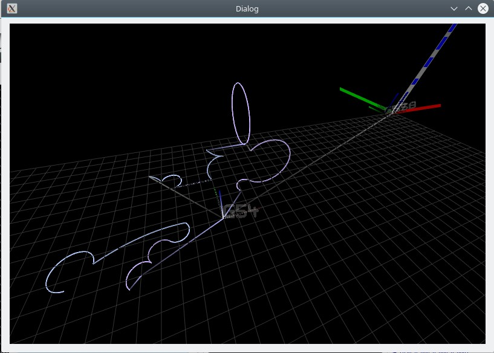
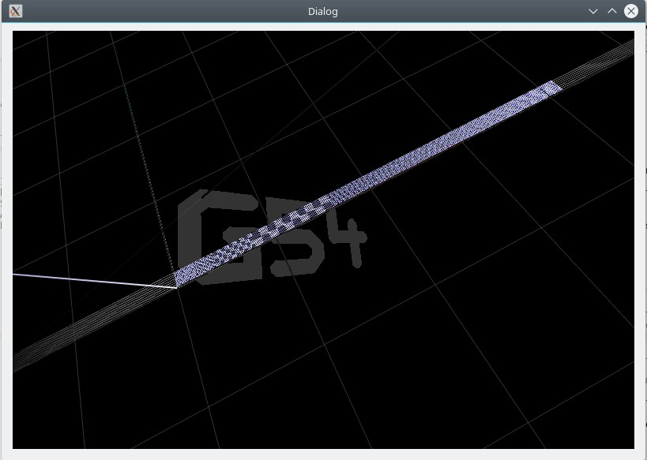

# gerbil_gui - Graphical User Interface for the "grbl" CNC controller

Python scripting and realtime OpenGL 3D visualization of gcode plus
streaming to the [grbl](https://github.com/grbl/grbl) CNC controller,
implemented in Python3 with Qt5 bindings.

## Installation

Your graphics hardware and drivers need to support at least OpenGL version 2.1 with GLSL version 1.20.

Ideally, you also need an Arduino board with a recent version of grbl flashed onto it, however the Gcode simulator and scripting will even work without an Arduino board connected.

Get and install Python3 and git for your OS. Then:

    git clone https://github.com/michaelfranzl/gerbil_gui
    cd gerbil_gui
    git clone https://github.com/michaelfranzl/gerbil.git
    git clone https://github.com/michaelfranzl/pyglpainter.git
    git clone https://github.com/michaelfranzl/gcode_machine.git
    
Start the GUI (the path to a serial port on Windows is "COMx" where x is a number):

    python ./gerbil_gui.py gui --path=/dev/ttyACM0

### Dependencies in Windows

    pip install pyserial
    pip install svgwrite
    pip install PyQt5
    pip install numpy
    pip install PyOpenGL
    pip insatll Pillow
    
The installation of scipy may be difficult on Windows, but it is optional unless
you want to use the feature that adapts Gcode to an uneven surface via probe cycles:

    pip install scipy
    

### Dependencies in Debian Jessie

    apt-get install python3 python3-pip python3-serial python3-pil python3-numpy python3-scipy python3-pyqt5 python3-pyqt5.qtopengl python3-opengl
    
    pip install svgwrite

    
## Update Python code from Qt .ui file

Useful for developers only:

    pyuic5 -o lib/qt/gerbil_gui/ui_mainwindow.py lib/qt/gerbil_gui/mainwindow.ui
